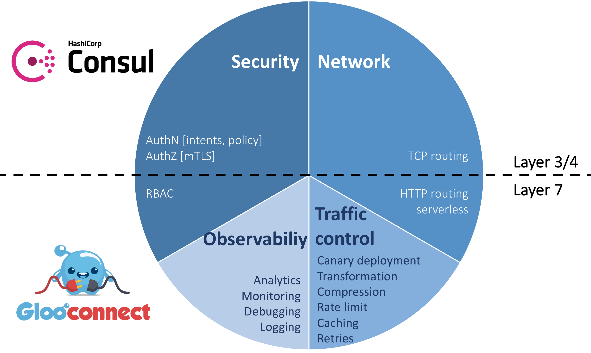
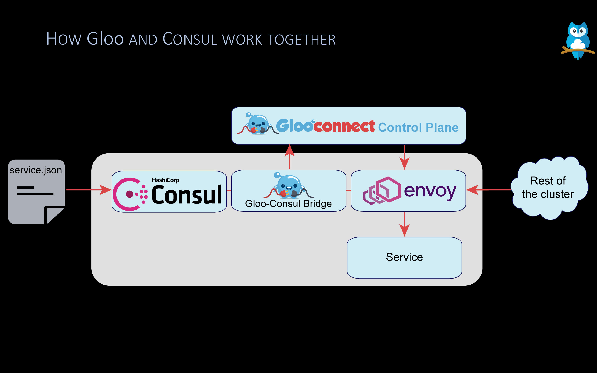

<h1 align="center">
    
   
  The Consul-Native Service Fabric
</h1>

### What is Gloo Connect?

Gloo Connect is built on top of [Consul](https://github.com/hashicorp/consul) and [Gloo](https://github.com/solo-io/gloo) to enable real time route authorization and response configuration management. Gloo Connect leverages Consul's Level 3/4 TCP authentication and Gloo's Level 7 function routing to provide a complete secure, observable, and configurable service delivery environment.

 

    

 
    

## Features of Gloo Connect
* **Low Latency Authentication**: Consul's credential management and Gloo Connect's plugins to Envoy combine to provide authentication with minimal overhead
* **Deployment Flexibility**: Integrates with your exisiting infrastructure
* **Secure Feature Release Management**: Function and request level configuration provides devops teams grainular real time control of feature deployment.

## Architecture Overview
 

    

 

## Documentation
* [Gloo Connect Documentation](https://glooconnect.solo.io)

Blogs & Demos
-----
* [Announcement Blog](https://medium.com/solo-io/)

Community
-----
Join us on our slack channel: [https://slack.solo.io/](https://slack.solo.io/)

---

### Thanks

**Gloo Connect** would not be possible without the valuable open-source work of projects in the community. We would like to extend 
a special thank-you to [Envoy](https://www.envoyproxy.io) and [Consul](https://github.com/hashicorp/consul).
